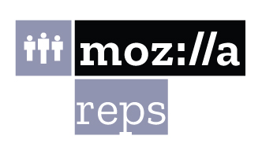
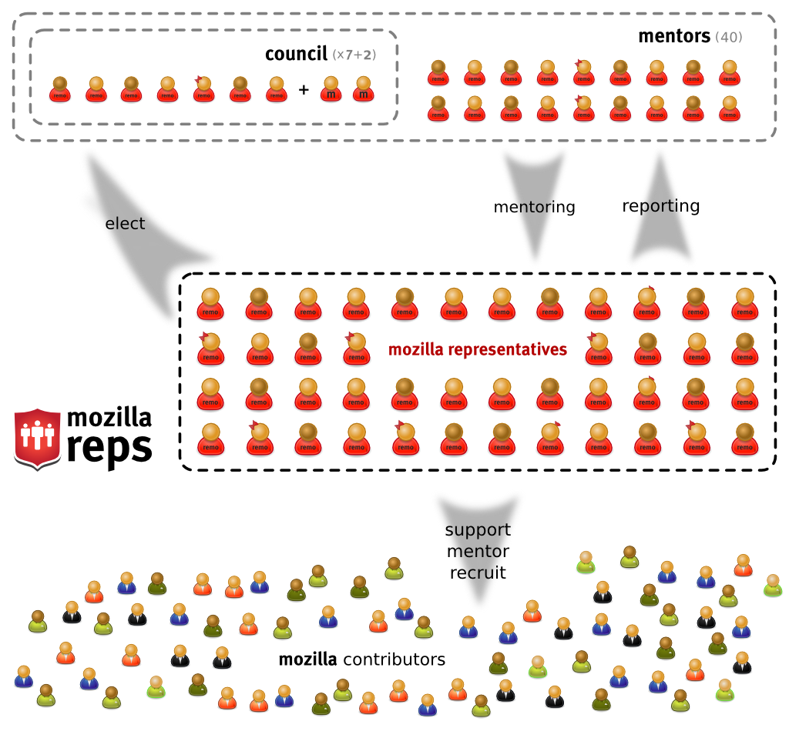
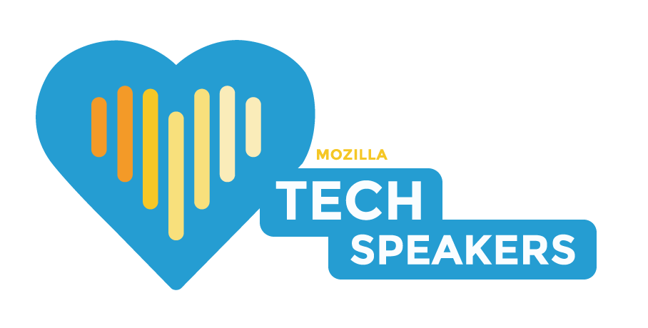
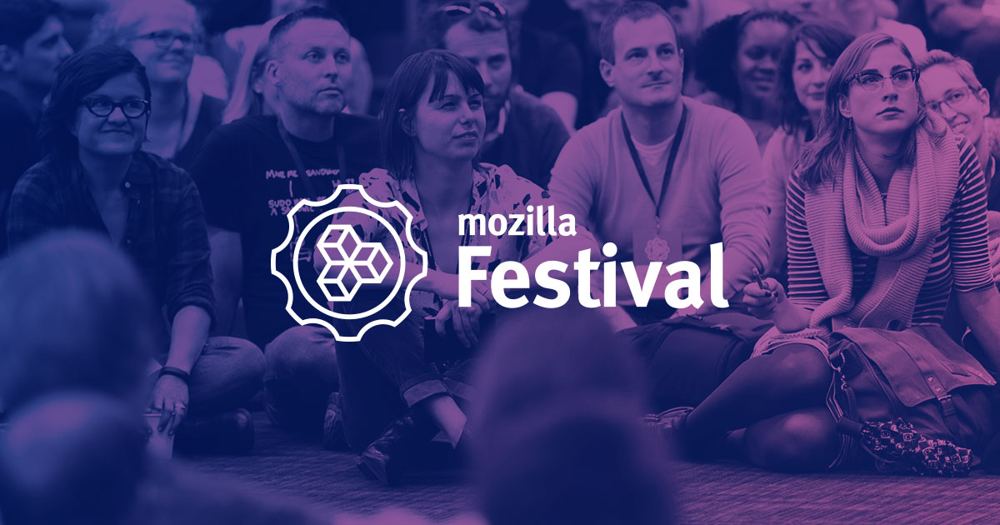
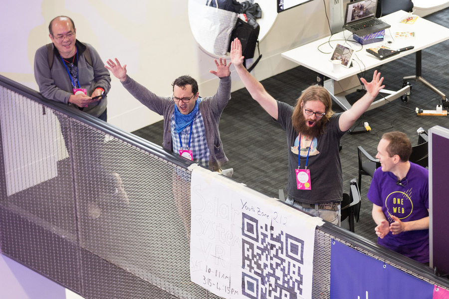
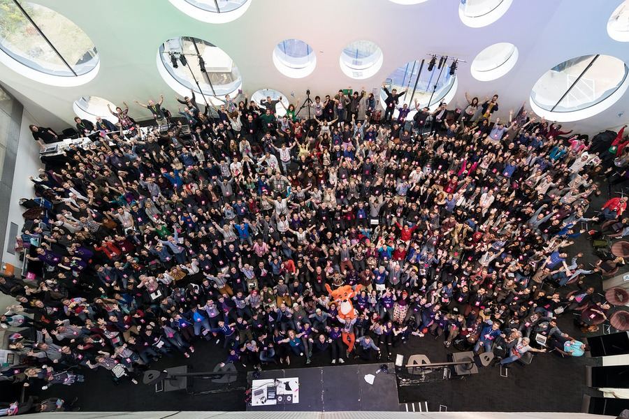
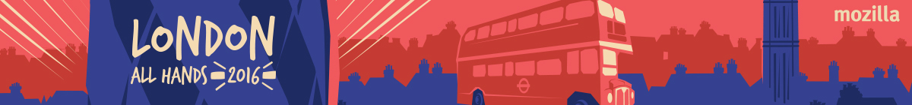
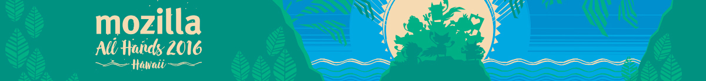

class: center middle
# .mozilla[] Communities im Wandel
Florian Merz
•
[mozillians.org/u/fiji](https://mozillians.org/u/fiji)
•
[@fiji_flo](https://twitter.com/fiji_flo)
---
# Überblick

* Was ist .mozilla[]?
* In welchen Bereichen ist die Community aktiv?
* Die Mozilla Community
  * Lokale Communities
  * Das Reps Programm
  * Campus Clubs
  * Mozilla Festival
* Hand in Hand mit Mitarbeitern

---
class: center middle

# .mozilla[]: Wer, wie, was, warum.

---
# Mozillas Mission

Unsere Mission besteht darin, dafür zu sorgen, dass das Internet eine weltweite
öffentliche und für alle zugängliche Ressource ist. Ein Internet, für das
Menschen zuerst kommen, wo der Einzelne sein eigenes Erlebnis gestalten kann und
Einfluss, Sicherheit und Unabhängigkeit besitzt.
([Quelle](https://www.mozilla.org/de/mission/))

---
# Mozillas drei Säulen

* [Mozilla Community](https://www.mozilla.org/de/contribute/)
  * Eine globale Community aus Mitmachern (Contributors) am Mozilla Projekt.
  * Wir nennen uns Mozillans und verfolgen gemeinsam Mozillas Mission.
--

* [Mozilla Foundation](https://www.mozilla.org/de/foundation/)
  * Die Non-Profit-Oganisation hinter dem Mozilla Projekt.
  * Kümmert sich um die Agenda, politische Projekte und verwaltet die Marke Mozilla.
  * Treibt eigene Projekte voran, z.b. Webkompetenz.
--

* [Mozilla Corporation](https://www.mozilla.org/en-US/foundation/moco/)
  * Gehört zu 100% der Mozilla Foundation.
  * Beschäftigt die Mehrheit der Mozilla-Mitarbeiter.

---
# Mozilla Foundation

Drei Progammschwerpunkte:
* Themen setzen:
  * Datenschutz und Sicherheit
  * Open Innovation
  * Dezentralisierung
  * Webkompetenz
  * Digitale Inklusion
* Führende Personen verbinden.
* Menschen motivieren.

---
background-image: url(amazing_firefox.jpg)
background-position: center
background-size: cover
background-repeat: no-repeat

# .white[Mozilla Corporation]

.split[
* .white[Firefox 57]
* .white[Rust & Servo]
* .white[WebVR & WebAR]
* .white[Firefox Klar]
* .white[– vieles mehr]
]

---
class: middle center

# In welchen Bereichen ist die .mozilla[] Community aktiv?

---
# Aufgabenbereiche

* Codebeiträge zu Firefox und anderen Mozilla Projekten
* Vermitteln digitaler Kompetenz
* Übersetzungen
* Organisieren von Befürworterkampagnen
* Schreiben der meistverlinkten Web-Entwickler-Site der Welt (MDN)

---
class: center middle
# Die .mozilla[] Community

---
# Jeder kann ein Mozillian sein!

Wer Lust hat zu Mozillas Mission bezutragen kann einfach mit machen:

* Organisiere eine Veranstaltung: Veranstaltungsvorlagen gibt es unter
  [activate.mozilla.community](https://activate.mozilla.community/)
* Besuche: [whatcanidoformozilla.og](https://whatcanidoformozilla.org/?lang=de)
* Rede mit Freunden, Familie und Bekannten über Mozillas Ziele und warum wir uns
  für ein offenes Internet einsetzen müssen.
* Spende: [donate.mozilla.org](https://donate.mozilla.org/de)

---
# Aber wir haben auch ein wenig Struktur

* Lokale Communities
* Das Reps Programm
* Campus Clubs
* Mozilla Festival

---
background-image: url(yearbook.png)
background-position: center
background-repeat: no-repeat
background-size: cover

class: middle center
# .black[Lokale Communities]
## .black[Jahrbuch 2016]

---
background-image: url(Eu-gathering-2016.jpg)
background-position: center
background-repeat: no-repeat
background-size: cover

class: middle center
# .black[Europäisches Community Treffen]
## .black[Berlin 2016]

---
class: center middle

---
# Das Mozilla Reps Programm (ReMo)

Ermöglicht seit 2011 Mozillians offizielle Vertreter Mozillas zu sein.

* Zugang zu internen Informationen und Materialien (NDA)
* Ein starkes Netzwerk aus sehr aktiven Mozillians
* Materialien und Budget für eigene Veranstaltungen
* Mittel um Veranstaltungen zu besuchen
* Einfacher Zugang zu Mozillamitarbeitern

Aufgaben:

* Mozilla in ihrer Region repräsentieren
* Mozillas Mission verbreiten
* Lokale Communities unterstützen und stärken
* Neue Mitmacher suchen und fördern

---
# Mozilla Reps: Struktur

.twocols[
.col50[
Organe:
* Rat (council)
  * 7 Communitymitglieder
  * 2 Mitarbeiter
* Mentoren
* Reps
]
.col50[

]
]

---
# Mozilla Reps: Kommunikation und Resourcen

* Reports und Einstiegspunkt: [reps.mozilla.org](https://reps.mozilla.org/)
* Discourse: [discourse.mozilla.org/c/reps](https://discourse.mozilla.org/c/reps)
* Air Mozilla (auch interne Videos): [air.mozilla.org](https://air.mozilla.org/)
* ReMo Wiki Seiten: [wiki.mozilla.org/ReMo](https://wiki.mozilla.org/ReMo)
* Weekly ReMo Call

---
class: middle center

---
# TechSpeakers (seit 2015)

TechSpeakers ist ein Programm das die Entwicklerwahrnehmung und Rezeption des
Open Web, Firefox und Mozillas erhöhen soll.

Hierzu sollen:

* Eine Basis an qualifizierten und gut informierten freiwilligen Referenten
  aufgebaut werden.
* Unterstützende Trainings und Vortragsmaterialien angeboten werden.

Um:

* Zum richtigen Zeitpunkt aktuelle Themen auf regionalen Veranstaltungen zu
  präsentieren.

---
background-image: url(clubs.svg)
background-position: center
background-repeat: no-repeat
background-size: contain

class: middle center

#.black[Mozilla Campus Clubs]

---
# Mozilla Campus Clubs

2016 startete Mozilla das Campus Clubs Programm.

Es zielt darauf ab Studierende in Mozillahochschulgruppen zu
organisieren und so Mozillas Mission voran zu treiben.

---
class: middle center

---
class: middle center

---
class: middle center

---
# .mozilla[] festival (MozFest)

Ein Festival rund um das offene Internet.

Jeden Oktober in London.

* über 1600 Teilnehmer aus mehr als 50 Ländern
* 325 Workshops und Sessions
* Mehrere Spaces:
  * Decentralization
  * Digital Inclusion
  * Open Innovation
  * Privacy and Security
  * Web Literacy
  * Youth Zone

---
class: middle center

## .black[Mozfest 2017]
## .black[27\. \- 29\. Oktober Ravensbourne College, London]
## [mozillafestival.org](https://mozillafestival.org/)

---
class: middle center

# .black[Hand in Hand mit Mitarbeitern]

---
class: middle center

# .black[all hands / work weeks]

---
# All Hands

* 2 mal pro Jahr (Juni / Dezember)
* Alle Mitarbeiter und eingeladene Freiwillige an einem Ort
* Zentraler Bestandteil der Jahresplanung
* Enge Zusammenarbeit zwischen Mitarbeitern und Freiwilligen

---
background-image: url(57.png)
background-position: center
background-repeat: no-repeat
background-size: contain

---
class: middle center

# .black[Fragen?]

---
class: middle center

## Bilder:
* [github.com/FirefoxUX](https://github.com/FirefoxUX)
* [flickr.com/photos/mozfest/](https://www.flickr.com/photos/mozfest/)
